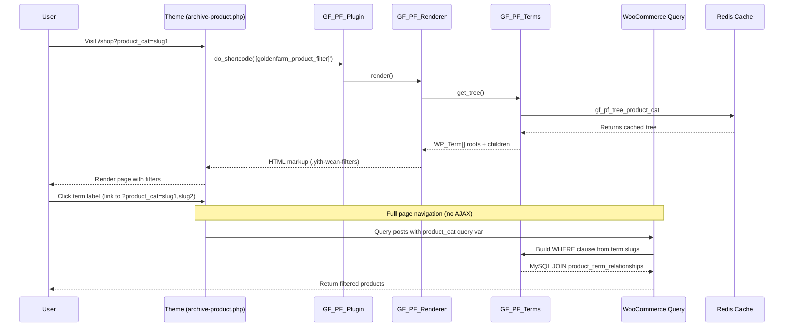

# GoldenFarm Product Filter — Technical Documentation

## Overview

GoldenFarm Product Filter là plugin thay thế YITH WooCommerce AJAX Product Filter bằng một giải pháp lightweight, native WooCommerce, thân thiện với SEO và hiệu năng cao. Plugin chỉ tập trung vào **1 taxonomy duy nhất: `product_cat`** và render **1 block duy nhất** (THƯƠNG HIỆU) theo cây 3 cấp (Brand root → Nhóm ngành hàng → Sản phẩm con).

### Lý do thay đổi

| Vấn đề với YITH | Giải pháp GoldenFarm |
|-----------------|----------------------|
| Query không native (`yith_wcan_*`) | Dùng native `product_cat` query var |
| URL không cache (`?yith_wcan=...`) | URL cacheable (`?product_cat=slugs`) |
| AJAX requests phức tạp | Full-page navigation (no JS) |
|依赖 jQuery ion.range-slider, WPML | Không dependency ngoài |
| CSS ~20KB | CSS ~1KB |

---

## Kiến trúc plugin

```
goldenfarm-product-filter/
├── goldenfarm-product-filter.php    # Main plugin controller
├── includes/
│   ├── class-gf-pf-terms.php        # Term tree + URL building
│   ├── class-gf-pf-renderer.php     # HTML renderer
│   └── class-gf-pf-assets.php       # CSS/JS enqueuer
└── assets/
    ├── css/gf-pf.css                # Minimal base styles
    └── js/gf-pf.js                  # Toggle handling
```

---

## Flow hoạt động



---

## Các class chính

### 1. `GF_PF_Plugin`

**Vai trò:** Singleton controller, register hooks

**Methods:**
- `instance()` — Singleton accessor
- `__construct()` — Register `init`, `wp_enqueue_scripts` hooks
- `register_shortcode()` — Register `[goldenfarm_product_filter]`
- `invalidate_term_cache()` — Cache invalidation callback

**Hooks:**
```php
add_action( 'init', array( $this, 'register_shortcode' ) );
add_action( 'wp_enqueue_scripts', array( 'GF_PF_Assets', 'maybe_enqueue' ), 20 );

add_action( 'created_product_cat', array( $this, 'invalidate_term_cache' ) );
add_action( 'edited_product_cat', array( $this, 'invalidate_term_cache' ) );
add_action( 'delete_product_cat', array( $this, 'invalidate_term_cache' ) );
add_action( 'set_object_terms', array( $this, 'invalidate_term_cache' ) );
```

---

### 2. `GF_PF_Terms`

**Vai trò:** Đọc `product_cat` taxonomy, build tree cache, URL building

**Methods:**

| Method | Description |
|--------|-------------|
| `taxonomy()` | Return taxonomy name (default: `product_cat`) |
| `get_roots()` | Return root terms (parent=0) |
| `get_tree()` | Return full hierarchical tree (cached in Redis) |
| `get_children( $parent_id )` | Return children of a term |
| `get_active_slugs()` | Return currently selected term slugs |
| `is_term_active( $term )` | Check if term is active |
| `get_base_url()` | Return current page URL (no query string) |
| `get_term_url( $term, $taxonomy, $multiple )` | Build toggle URL for term |
| `get_term_counts( $taxonomy )` | Product counts per term (cached) |
| `invalidate_cache( $taxonomy )` | Bump cache version |

**Cache structure:**
```php
// Cache key: 'gf_pf_tree_product_cat'
// Cache group: 'gf_pf'
// TTL: DAY_IN_SECONDS

array(
  'version'  => '1620000000', // Bumped on taxonomy change
  'roots'    => array( WP_Term, WP_Term, ... ),
  'children' => array(
    12 => array( WP_Term, WP_Term ), // children of term 12
    15 => array( WP_Term ),
    ...
  )
)
```

**Active slugs detection:**
- `is_tax( product_cat )` →queried term
- `get_query_var( product_cat )` →comma-separated slugs
- `$_GET[ product_cat ]` →sanitized slugs

---

### 3. `GF_PF_Renderer`

**Vai trò:** Render HTML giống YITH (`yith-wcan-*` classes)

**Methods:**

| Method | Description |
|--------|-------------|
| `shortcode( $atts )` | Shortcode callback |
| `render( $args )` | Echo HTML directly |
| `get_filters_html( $args )` | Build container HTML (ONE block: THƯƠNG HIỆU) |
| `render_term_recursive( $term, $level, $multiple, $taxonomy, $counts, $show_counts )` | Recursive term rendering (Level 1 có con → `<ul class="filter-items level-2">`)

**Output structure:**
```html
<div class="yith-wcan-filters no-title" id="gf-pf-filters">
  <div class="filters-container">
    <form method="get" action="{base_url}">
      <div class="yith-wcan-filter filter-tax hierarchical checkbox-design">
        <h4 class="filter-title">{title}</h4>
        <div class="filter-content">
          <ul class="filter-items level-0">
            <li class="filter-item checkbox level-0 active opened">
              <label>
                <input type="checkbox" value="{slug}" checked>
                <a href="{term_url}" class="term-label">{term_name}</a>
              </label>
              <span class="toggle-handle"></span>
              <ul>
                <!-- children -->
              </ul>
            </li>
          </ul>
        </div>
      </div>
    </form>
  </div>
</div>
```

**Class mapping:**
| YITH class | GoldenFarm |
|------------|------------|
| `.yith-wcan-filters` | ✅ |
| `.yith-wcan-filter` | ✅ |
| `.filter-title` | ✅ |
| `.filter-content` | ✅ |
| `.filter-items.level-N` | ✅ |
| `.filter-item` | ✅ |
| `.checkbox` | ✅ |
| `.opened` | ✅ (expanded by default) |
| `.active` | ✅ (if term selected) |
| `.toggle-handle` | ✅ |
| `.term-label` | ✅ (link with `data-term-slug`) |

**Hierarchy classes (thêm bởi `GF_PF_Renderer::render_term_recursive()`):**

| Class | Level | Ý nghĩa |
|-------|-------|---------|
| `is-brand-root` | `level-0` | Cấp 0 — Thương hiệu / gốc lớn nhất |
| `is-group-parent` | `level-1` | Cấp 1 — Nhóm ngành hàng (Thực phẩm, NLPC & Làm bánh, ...) |
| `is-product-leaf` | `level-2+` | Cấp 2+ — Sản phẩm con / lá |

> Mapping được tính tự động theo độ sâu trong `render_term_recursive()`: `level 0 → is-brand-root`, `level 1 → is-group-parent`, `level ≥ 2 → is-product-leaf`. Không cần sửa renderer khi thêm nhánh mới.

---

## Taxonomy CSS — Quy trình & Maintenance

Toàn bộ style của cây phân cấp taxonomy nằm trong **`assets/css/gf-pf.css`**, mục **`/* hierarchy levels */`** (cuối file, trước khối mobile media query). Đây là nơi duy nhất cần sửa khi điều chỉnh giao diện theo cấp.

### 1. Cấu trúc 3 cấp

| Cấp | Class | Ví dụ | Giao diện hiện tại |
|-----|-------|-------|--------------------|
| 0 | `.filter-item.is-brand-root > label .term-label` | Thương hiệu | `#2b7837`, **800**, uppercase, `14px` |
| 1 | `.filter-item.is-group-parent > label .term-label` | Thực phẩm / NLPC & Làm bánh | `#333`, **600**, italic, `13px` |
| 2 | `.filter-item.is-product-leaf > label .term-label` | Sản phẩm con | `#555`, 400, `13px` |

Thụt lề được kiểm soát bởi:
- Cấp 1: `.yith-wcan-filters.gf-pf-filters .filter-items.level-1 { padding-left: 12px; }`
- Cấp 2: `.yith-wcan-filters.gf-pf-filters .filter-items.level-2 { padding-left: 18px; margin-top: 3px; }`

### 2. Quy tắc bắt buộc khi sửa CSS

1. **Luôn prefix** selector với `.yith-wcan-filters.gf-pf-filters` để không ảnh hưởng ngoài plugin.
2. **Target `.term-label`** (là thẻ `<a>`), không target `label` chung — tránh đè styles cơ bản.
3. Dùng **tab indentation** và biến CSS (`--gf-pf-*`) nếu có thể; màu cấp đặc thù có thể hardcode.
4. Giữ `!important` chỉ ở cấp 0/1 (đè `font-weight` mặc định của `label`); cấp 2 không cần.
5. Không thêm media query cho từng cấp — responsive đã xử lý ở khối mobile chung.
6. Khi thay đổi, **bump version** trong `goldenfarm-product-filter.php` (`GF_PF_VERSION`) để trình duyệt/CDN nạp lại CSS mới.

### 3. Thêm cấp thứ 4 (ví dụ)

1. Renderer tự gán `is-product-leaf` cho mọi level ≥ 2 → không cần đổi PHP.
2. Trong CSS, thêm rule cho `is-product-leaf` (cấp 3+) hoặc tạo class mới:
   ```css
   .yith-wcan-filters.gf-pf-filters .filter-items .filter-item.is-product-leaf > label .term-label { /* style cấp sâu */ }
   ```
3. Điều chỉnh thụt lề bằng `.filter-items.level-3`.

### 4. CSS hierarchy hiện tại (reference)

```css
/* Cấp 0: Thương hiệu (Lớn nhất, Xanh lá đậm, Viết hoa) */
.yith-wcan-filters.gf-pf-filters .filter-items .filter-item.is-brand-root > label .term-label {
	font-weight: 800 !important;
	text-transform: uppercase;
	color: #2b7837;
	font-size: 14px;
}

/* Cấp 1: Nhóm ngành hàng (Ví dụ: Thực phẩm / NLPC & Làm bánh) */
.yith-wcan-filters.gf-pf-filters .filter-items .filter-item.is-group-parent > label .term-label {
	font-weight: 600 !important;
	color: #333;
	font-size: 13px;
	font-style: italic;
}

/* Cấp 2: Sản phẩm con (Thụt lề, màu tiêu chuẩn) */
.yith-wcan-filters.gf-pf-filters .filter-items.level-1 {
	padding-left: 12px;
}

.yith-wcan-filters.gf-pf-filters .filter-items.level-2 {
	padding-left: 18px;
	margin-top: 3px;
}

.yith-wcan-filters.gf-pf-filters .filter-items .filter-item.is-product-leaf > label .term-label {
	font-weight: 400;
	font-size: 13px;
	color: #555;
}
```

---

### 4. `GF_PF_Assets`

**Vai trò:** Enqueue CSS/JS chỉ khi filter có thể hiển thị

**Methods:**
- `should_enqueue()` — Check current page
- `maybe_enqueue()` — Enqueue if needed

**Enqueued:**
- `gf-pf` (CSS) — `assets/css/gf-pf.css`
- `gf-pf` (JS) — `assets/js/gf-pf.js` (depends: jQuery)

**Trigger pages:**
- `is_shop()`
- `is_post_type_archive( 'product' )`
- `is_tax( 'product_cat' )`
- `is_tax( 'product_tag' )`
- `gf_pf_enqueue` filter

---

## Hooks & Filters

### Filters

| Filter | Description | Default |
|--------|-------------|---------|
| `gf_pf_taxonomy` | Taxonomy used for filtering | `product_cat` |
| `gf_pf_orderby` | Term ordering | `name` |
| `gf_pf_order` | Term order direction | `ASC` |
| `gf_pf_multiple` | Allow multiple selection | `false` |
| `gf_pf_base_url` | Base URL for filter links | `home_url( $wp->request )` |
| `gf_pf_enqueue` | Force enqueue assets | `false` |

### Actions

| Action | Description |
|--------|-------------|
| `gf_pf_after_render_term` | After each term rendered (include term, level, html) |
| `gf_pf_before_render` | Before filter container rendered |

---

## Usage

### 1.替换 shortcode trong theme

**Before (YITH):**
```php
// woocommerce/archive-product.php
echo do_shortcode('[yith_wcan_filters slug="draft-preset"]');
```

**After (GoldenFarm):**
```php
// woocommerce/archive-product.php
echo do_shortcode('[goldenfarm_product_filter title="Thương hiệu"]');
```

### 2. Shortcode attributes

| Attribute | Description | Default |
|-----------|-------------|---------|
| `title` | Filter section title | `Thương hiệu` |
| `multiple` | Allow multiple selection (`yes`/`no`) | `no` |

### 3. Template function

```php
// Trong theme template
if ( function_exists( 'gf_pf_render_filters' ) ) {
    gf_pf_render_filters( array(
        'title'    => 'Danh mục sản phẩm',
        'multiple' => true,
    ) );
}
```

---

## Cache invalidation

Cache được invalid tự động khi:

```php
// goldenfarm-product-filter.php
add_action( 'created_product_cat', array( $this, 'invalidate_term_cache' ) );
add_action( 'edited_product_cat', array( $this, 'invalidate_term_cache' ) );
add_action( 'delete_product_cat', array( $this, 'invalidate_term_cache' ) );
add_action( 'set_object_terms', array( $this, 'invalidate_term_cache' ) );
```

**Cache version format:** `gf_pf_term_version_product_cat`

---

## Performance optimization

### 1. Term tree cache
- Cache trong Redis (object cache)
- TTL: `DAY_IN_SECONDS`
- Versioned (invalidation khi taxonomy change)

### 2. CSS/JS
- CSS: ~5KB (base styles + hierarchy levels)
- JS: ~1.5KB (toggle handle + navigation)
- Conditional enqueue (chỉ product pages)

### 3. No external dependencies
- Không dùng jQuery UI
- Không dùng ion.range-slider
- Không dùng selectWoo
- Không dùng AJAX endpoint

---

## Migration từ YITH

### 1. Thay shortcode
```diff
- echo do_shortcode('[yith_wcan_filters slug="draft-preset"]');
+ echo do_shortcode('[goldenfarm_product_filter title="Thương hiệu"]');
```

### 2. Tắt plugin YITH
- Disable hoặc uninstall `yith-woocommerce-ajax-product-filter`
- Xóa preset `draft-preset` nếu không dùng nữa

### 3. CSS compatibility
- Theme CSS (CanhCamTheme/styles/main.min.css) vẫn dùng được
- HTML markup giống YITH (`yith-wcan-*` classes)
- CSS override trong theme không cần sửa

---

## Troubleshooting

### Filter không hiển thị
1. Kiểm tra `goldenfarm-product-filter.php` đã active
2. Kiểm tra theme gọi đúng shortcode
3. Kiểm tra `is_shop()` hoặc `is_post_type_archive( 'product' )`

### Term không hiển thị
1. Kiểm tra `product_cat` taxonomy có terms
2. Kiểm tra `gf_pf_tree_product_cat` trong Redis
3. Manual: `wp_cache_delete( 'gf_pf_tree_product_cat', 'gf_pf' );`

### URL không working
1. Kiểm tra `product_cat` query var được rewrite đúng
2. Kiểm tra permalinks structure
3. `settings/permalink.php` → Save lại

---

## Future enhancements

### proposals
- [ ] AJAX live update (tùy chọn, disable default navigation)
- [ ] Price range filter (native WooCommerce price filter)
- [ ] Stock/On-sale filter
- [ ] Custom taxonomies support
- [ ] Widget support
- [ ] Elementor block

---

## License

GPLv2 or later — same as WordPress

---

**Author:** GoldenFarm Dev  
**Version:** 1.2.1  
**Requires:** WooCommerce, WordPress 6.0+, PHP 7.4+
