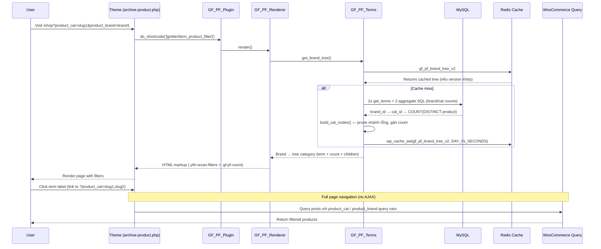

# GoldenFarm Product Filter — Technical Documentation

## Overview

GoldenFarm Product Filter là plugin thay thế YITH WooCommerce AJAX Product Filter bằng một giải pháp lightweight, native WooCommerce, thân thiện với SEO và hiệu năng cao. Plugin lọc theo **2 taxonomy**: `product_brand` (Thương hiệu) và `product_cat` (Danh mục), render **1 block duy nhất** (THƯƠNG HIỆU) theo cây phân cấp (Brand root → Nhóm ngành hàng → Loại sản phẩm → cấp sâu hơn).

### Lý do thay đổi

| Vấn đề với YITH | Giải pháp GoldenFarm |
|-----------------|----------------------|
| Query không native (`yith_wcan_*`) | Dùng native `product_cat` / `product_brand` query var |
| URL không cache (`?yith_wcan=...`) | URL cacheable (`?product_cat=slugs`) |
| AJAX requests phức tạp | Full-page navigation (no JS) |
|依赖 jQuery ion.range-slider, WPML | Không dependency ngoài |
| CSS ~20KB | CSS ~5KB |

---

## Kiến trúc plugin

```
goldenfarm-product-filter/
├── goldenfarm-product-filter.php    # Main plugin controller
├── includes/
│   ├── class-gf-pf-terms.php        # Term tree + URL building (DB-driven)
│   ├── class-gf-pf-renderer.php     # HTML renderer (recursive)
│   └── class-gf-pf-assets.php       # CSS/JS enqueuer
├── assets/
│   ├── css/gf-pf.css                # Base styles + hierarchy levels
│   └── js/gf-pf.js                  # Toggle handling (mọi cấp)
├── filter.py                        # CLI tool: xuất cây Brand→Cat từ DB ra STRUCTURE.md
└── clean_db.py                      # CLI tool: dọn danh mục rác / chuẩn hóa cấp
```

---

## Flow hoạt động



---

## Các class chính

### 1. `GF_PF_Plugin`

**Vai trò:** Singleton controller, register hooks

**Methods:**
- `instance()` — Singleton accessor
- `__construct()` — Register `init`, `wp_enqueue_scripts` hooks
- `register_shortcode()` — Register `[goldenfarm_product_filter]`
- `invalidate_term_cache()` — Cache invalidation callback

**Hooks:**
```php
add_action( 'init', array( $this, 'register_shortcode' ) );
add_action( 'wp_enqueue_scripts', array( 'GF_PF_Assets', 'maybe_enqueue' ), 20 );

add_action( 'created_product_cat', array( $this, 'invalidate_term_cache' ) );
add_action( 'edited_product_cat', array( $this, 'invalidate_term_cache' ) );
add_action( 'delete_product_cat', array( $this, 'invalidate_term_cache' ) );
add_action( 'set_object_terms', array( $this, 'invalidate_term_cache' ) );
```

---

### 2. `GF_PF_Terms`

**Vai trò:** Đọc taxonomy, **build cây Brand→Category từ quan hệ thực tế trong DB** (giống `filter.py`), URL building.

**Methods:**

| Method | Description |
|--------|-------------|
| `taxonomy()` | Return category taxonomy (default: `product_cat`) |
| `brand_taxonomy()` | Return brand taxonomy (default: `product_brand`) |
| `get_roots()` | Return root terms (parent=0) |
| `get_tree()` | Return full hierarchical tree của 1 taxonomy (cached) |
| `get_children( $parent_id )` | Return children of a term |
| `get_brand_tree()` | **Cây Brand → Category (đã prune nhánh rỗng, có count), cached** |
| `build_brand_tree()` | (private) Lấy brands + cats + counts từ DB |
| `query_brand_counts()` | (private) `brand_id => COUNT(DISTINCT publish product)` |
| `query_brand_category_counts()` | (private) `brand_id => [cat_id => count]` — 1 câu aggregate duy nhất |
| `build_cat_nodes()` | (private) Dựng/đệ quy cắt nhánh không có sản phẩm |
| `get_active_slugs()` | Return currently selected term slugs (memo tĩnh trong request) |
| `is_term_active( $term )` | Check if term is active |
| `get_base_url()` | Return current page URL (no query string) |
| `get_term_url( $term, $taxonomy, $multiple )` | Build toggle URL for term |
| `get_reset_url()` | URL xóa **cả `product_cat` lẫn `product_brand`** (giữ sort/search) |
| `get_term_counts( $taxonomy )` | Product counts per term (cached) |
| `invalidate_cache( $taxonomy )` | Bump cache version |

**Cache structure (brand tree):**
```php
// Cache key: 'gf_pf_brand_tree_v2'
// Cache group: 'gf_pf'
// TTL: DAY_IN_SECONDS

array(
  'version' => '1620000000', // Bumped khi product_brand/product_cat thay đổi
  'items'   => array(
    array(
      'brand'      => WP_Term,            // product_brand term
      'count'      => 131,                // số SP publish của brand
      'categories' => array(
        array(
          'term'     => WP_Term,          // product_cat term
          'count'    => 116,              // SP publish gán trực tiếp vào cat này
          'children' => array( /* đệ quy */ ),
        ),
      ),
    ),
  ),
)
```

**Logic tối ưu (theo `filter.py`):**
- Cây được dựng từ **quan hệ sản phẩm thực tế**: 1 câu SQL aggregate `wp_posts ⋈ wp_term_relationships ⋈ wp_term_taxonomy` đếm `COUNT(DISTINCT p.ID)` cho từng cặp `(brand, cat)` — **không N+1 query**, không dùng heuristic ghép slug.
- **Prune nhánh rỗng**: một category chỉ giữ lại khi có SP của brand đó hoặc là tổ tiên của category có SP (nhánh 0 SP bị cắt).
- `count` chỉ tính sản phẩm `post_status = 'publish'`.

**Active slugs detection:**
- `is_tax( product_cat )` →queried term
- `get_query_var( product_cat )` →comma-separated slugs
- `$_GET[ product_cat ]` →sanitized slugs

---

### 3. `GF_PF_Renderer`

**Vai trò:** Render HTML giống YITH (`yith-wcan-*` classes), đệ quy theo độ sâu cây.

**Methods:**

| Method | Description |
|--------|-------------|
| `shortcode( $atts )` | Shortcode callback |
| `render( $args )` | Echo HTML directly |
| `get_filters_html( $args )` | Build container HTML (ONE block: THƯƠNG HIỆU + nút Xóa bộ lọc) |
| `render_cat_level( $nodes, $level, $taxonomy )` | **Đệ quy** render một cấp danh mục (level-1 group, level-2+ leaf) |
| `cat_node_has_active( $nodes, $taxonomy )` | Kiểm tra subtree có node đang active (để auto-mở nhánh) |

**Output structure:**
```html
<div class="yith-wcan-filters no-title gf-pf-filters" id="gf-pf-filters">
  <div class="filters-container">
    <form method="get" action="{base_url}">
      <div class="yith-wcan-filter filter-tax hierarchical checkbox-design gf-pf-block">
        <h4 class="filter-title">
          <span class="gf-pf-title-text">{title}</span>
          <a class="gf-pf-reset" href="{reset_url}">Xóa bộ lọc</a>
        </h4>
        <div class="filter-content">
          <ul class="filter-items level-0">
            <li class="filter-item checkbox level-0 is-brand-root has-children opened active">
              <label>
                <input type="checkbox" name="product_brand" value="{brand_slug}" checked>
                <a href="{term_url}" class="term-label">{brand_name}</a>
                <span class="gf-pf-count">131</span>
              </label>
              <span class="toggle-handle"></span>
              <ul class="filter-items level-1">
                <li class="filter-item checkbox level-1 is-group-parent has-children opened">
                  <label>
                    <input type="checkbox" name="product_cat" value="{group_slug}">
                    <a href="{term_url}" class="term-label">Sản Phẩm</a>
                  </label>
                  <span class="toggle-handle"></span>
                  <ul class="filter-items level-2">
                    <li class="filter-item checkbox level-2 is-product-leaf has-children">
                      <!-- ... -->
                    </li>
                  </ul>
                </li>
              </ul>
            </li>
          </ul>
        </div>
      </div>
    </form>
  </div>
</div>
```

**Class mapping:**
| YITH class | GoldenFarm |
|------------|------------|
| `.yith-wcan-filters` | ✅ |
| `.yith-wcan-filter` | ✅ |
| `.filter-title` | ✅ (+ nút `.gf-pf-reset` bên phải) |
| `.filter-content` | ✅ |
| `.filter-items.level-N` | ✅ |
| `.filter-item` | ✅ |
| `.checkbox` | ✅ |
| `.opened` | ✅ (mở sẵn theo level) |
| `.active` | ✅ (nếu term đang chọn) |
| `.toggle-handle` | ✅ (mọi cấp có nhánh con) |
| `.term-label` | ✅ |
| `.gf-pf-count` | ✅ (badge số lượng SP publish) |

**Hierarchy classes (tự động theo độ sâu trong `render_cat_level()`):**

| Class | Level | Ý nghĩa |
|-------|-------|---------|
| `is-brand-root` | `level-0` | Cấp 0 — Thương hiệu / gốc lớn nhất |
| `is-group-parent` | `level-1` | Cấp 1 — Nhóm ngành hàng (Sản Phẩm, Chuyên mục Trang Chủ, ...) |
| `is-product-leaf` | `level-2+` | Cấp 2+ — Loại sản phẩm / lá |

> Không cần sửa renderer khi thêm nhánh mới: level 1 → `is-group-parent`, level ≥ 2 → `is-product-leaf`. Cấp sâu hơn chỉ cần thêm CSS thụt lề.

**Trạng thái mở/đóng:**
- Brand (`level-0`) và nhóm cấp 1 (`level-1`) luôn `opened` mặc định.
- Nhánh cấp ≥ 2 chỉ `opened` khi bản thân hoặc hậu duệ đang active.

---

## Taxonomy CSS — Quy trình & Maintenance

Toàn bộ style của cây phân cấp taxonomy nằm trong **`assets/css/gf-pf.css`**, mục **`/* hierarchy levels */`** (cuối file, trước khối mobile media query). Đây là nơi duy nhất cần sửa khi điều chỉnh giao diện theo cấp.

### 1. Cấu trúc 3 cấp

| Cấp | Class | Ví dụ | Giao diện hiện tại |
|-----|-------|-------|--------------------|
| 0 | `.filter-item.is-brand-root > label .term-label` | Thương hiệu | `#2b7837`, **800**, uppercase, `14px` |
| 1 | `.filter-item.is-group-parent > label .term-label` | Nhóm ngành hàng | `#333`, **600**, italic, `13px` |
| 2+ | `.filter-item.is-product-leaf > label .term-label` | Loại sản phẩm | `#555`, 400, `13px` |

**Thu gọn/mở nhánh (mọi cấp):**
- `.filter-item.has-children > ul.filter-items { display: none; }`
- `.filter-item.has-children.opened > ul.filter-items { display: block; }`
- `.filter-item.has-children > .toggle-handle` (mũi tên xoay 180° khi `.opened`)

**Thụt lề (đệ quy, cộng dồn theo cấp):**
- `.filter-items .filter-items { padding-left: 14px; }`
- Label có nhánh con: `padding-right: 36px` (tránh đè lên toggle-handle)

### 2. Quy tắc bắt buộc khi sửa CSS

1. **Luôn prefix** selector với `.yith-wcan-filters.gf-pf-filters` để không ảnh hưởng ngoài plugin.
2. **Target `.term-label`** (là thẻ `<a>`), không target `label` chung — tránh đè styles cơ bản.
3. Dùng **tab indentation** và biến CSS (`--gf-pf-*`) nếu có thể; màu cấp đặc thù có thể hardcode.
4. Giữ `!important` chỉ ở cấp 0/1 (đè `font-weight` mặc định của `label`); cấp 2 không cần.
5. Không thêm media query cho từng cấp — responsive đã xử lý ở khối mobile chung.
6. Khi thay đổi, **bump version** trong `goldenfarm-product-filter.php` (`GF_PF_VERSION`) để trình duyệt/CDN nạp lại CSS mới.

### 3. Thêm cấp thứ 4 (ví dụ)

1. Renderer tự gán `is-product-leaf` cho mọi level ≥ 2 → không cần đổi PHP.
2. Trong CSS, thêm rule cho `is-product-leaf` (cấp 3+) hoặc tạo class mới:
   ```css
   .yith-wcan-filters.gf-pf-filters .filter-items .filter-item.is-product-leaf > label .term-label { /* style cấp sâu */ }
   ```
3. Thụt lề tự cộng dồn qua `.filter-items .filter-items { padding-left: 14px; }` — không cần rule riêng.

### 4. CSS hierarchy hiện tại (reference)

```css
/* Cấp 0: Thương hiệu (Lớn nhất, Xanh lá đậm, Viết hoa) */
.yith-wcan-filters.gf-pf-filters .filter-items .filter-item.is-brand-root > label .term-label {
	font-weight: 800 !important;
	text-transform: uppercase;
	color: #2b7837;
	font-size: 14px;
}

/* Cấp 1: Nhóm ngành hàng */
.yith-wcan-filters.gf-pf-filters .filter-items .filter-item.is-group-parent > label .term-label {
	font-weight: 600 !important;
	color: #333;
	font-size: 13px;
	font-style: italic;
}

/* Cấp 2+: Sản phẩm con */
.yith-wcan-filters.gf-pf-filters .filter-items .filter-item.is-product-leaf > label .term-label {
	font-weight: 400;
	font-size: 13px;
	color: #555;
}

/* Thu gọn/mở mọi cấp */
.yith-wcan-filters.gf-pf-filters .filter-items .filter-item.has-children > ul.filter-items { display: none; }
.yith-wcan-filters.gf-pf-filters .filter-items .filter-item.has-children.opened > ul.filter-items { display: block; }

/* Thụt lề đệ quy */
.yith-wcan-filters.gf-pf-filters .filter-items .filter-items { padding-left: 14px; }
```

---

### 4. `GF_PF_Assets`

**Vai trò:** Enqueue CSS/JS chỉ khi filter có thể hiển thị

**Methods:**
- `should_enqueue()` — Check current page
- `maybe_enqueue()` — Enqueue if needed

**Enqueued:**
- `gf-pf` (CSS) — `assets/css/gf-pf.css`
- `gf-pf` (JS) — `assets/js/gf-pf.js` (depends: jQuery)

**Trigger pages:**
- `is_shop()`
- `is_post_type_archive( 'product' )`
- `is_tax( 'product_cat' )`
- `is_tax( 'product_tag' )`
- `gf_pf_enqueue` filter

---

## Hooks & Filters

### Filters

| Filter | Description | Default |
|--------|-------------|---------|
| `gf_pf_taxonomy` | Category taxonomy used for filtering | `product_cat` |
| `gf_pf_brand_taxonomy` | Brand taxonomy used for filtering | `product_brand` |
| `gf_pf_orderby` | Term ordering | `name` |
| `gf_pf_order` | Term order direction | `ASC` |
| `gf_pf_base_url` | Base URL for filter links | `home_url( $wp->request )` |
| `gf_pf_enqueue` | Force enqueue assets | `false` |

### Actions

| Action | Description |
|--------|-------------|
| `gf_pf_after_render_term` | After each term rendered (include term, level, html) |
| `gf_pf_before_render` | Before filter container rendered |

---

## Usage

### 1. Thay shortcode trong theme

**Before (YITH):**
```php
// woocommerce/archive-product.php
echo do_shortcode('[yith_wcan_filters slug="draft-preset"]');
```

**After (GoldenFarm):**
```php
// woocommerce/archive-product.php
echo do_shortcode('[goldenfarm_product_filter title="Thương hiệu"]');
```

### 2. Shortcode attributes

| Attribute | Description | Default |
|-----------|-------------|---------|
| `title` | Filter section title | `Thương hiệu` |

### 3. Template function

```php
// Trong theme template (CanhCamTheme/woocommerce/product-filter-menu.php)
if ( function_exists( 'gf_pf_render_filters' ) ) {
    gf_pf_render_filters( array(
        'title' => 'Danh mục sản phẩm',
    ) );
}
```

---

## Cache invalidation

Cache được invalid tự động khi taxonomy thay đổi:

```php
add_action( 'created_product_cat', array( $this, 'invalidate_term_cache' ) );
add_action( 'edited_product_cat', array( $this, 'invalidate_term_cache' ) );
add_action( 'delete_product_cat', array( $this, 'invalidate_term_cache' ) );
add_action( 'set_object_terms', array( $this, 'invalidate_term_cache' ) );
```

**Cache version format:** `gf_pf_term_version_{taxonomy}` (vd: `gf_pf_term_version_product_cat`, `gf_pf_term_version_product_brand`)

**Key chính:** `gf_pf_brand_tree_v2` (group `gf_pf`, TTL `DAY_IN_SECONDS`)

> **Lưu ý khi deploy v1.3.0:** nếu cache cũ (key `gf_pf_brand_tree`) còn trong Redis, flush thủ công các key `gf_pf_*` để cây mới render ngay.

---

## Performance optimization

### 1. Brand tree
- **1 câu SQL aggregate duy nhất** đếm toàn bộ `(brand, cat)` → **không N+1 query** (trước đây: `get_term_by` + `get_children` mỗi brand).
- Chỉ tính sản phẩm `publish`; **prune nhánh rỗng** → HTML gọn hơn.
- Cache trong Redis (object cache), TTL `DAY_IN_SECONDS`, versioned.

### 2. Renderer
- `get_active_slugs()` memo tĩnh theo request → không truy vấn lặp lại mỗi term.
- Đệ quy theo độ sâu thực tế, chỉ render nhánh có sản phẩm.

### 3. CSS/JS
- CSS: ~5KB (base styles + hierarchy levels)
- JS: ~1.5KB (toggle handle mọi cấp + navigation)
- Conditional enqueue (chỉ product pages)

### 4. No external dependencies
- Không dùng jQuery UI
- Không dùng ion.range-slider
- Không dùng selectWoo
- Không dùng AJAX endpoint

---

## Migration từ YITH

### 1. Thay shortcode
```diff
- echo do_shortcode('[yith_wcan_filters slug="draft-preset"]');
+ echo do_shortcode('[goldenfarm_product_filter title="Thương hiệu"]');
```

### 2. Tắt plugin YITH
- Disable hoặc uninstall `yith-woocommerce-ajax-product-filter`
- Xóa preset `draft-preset` nếu không dùng nữa

### 3. CSS compatibility
- Theme CSS (CanhCamTheme/styles/main.min.css) vẫn dùng được
- HTML markup giống YITH (`yith-wcan-*` classes)
- CSS override trong theme không cần sửa

---

## Troubleshooting

### Filter không hiển thị
1. Kiểm tra `goldenfarm-product-filter.php` đã active
2. Kiểm tra theme gọi đúng shortcode
3. Kiểm tra `is_shop()` hoặc `is_post_type_archive( 'product' )`

### Nhánh danh mục bị thiếu / cây sai
1. Kiểm tra sản phẩm đã được gán `product_brand` và `product_cat` đúng chưa
2. Kiểm tra `gf_pf_brand_tree_v2` trong Redis (flush `gf_pf_*` để build lại)
3. Chạy `filter.py` để xuất `STRUCTURE.md` đối chiếu cây thực tế
4. Manual: `wp_cache_delete( 'gf_pf_brand_tree_v2', 'gf_pf' );`

### URL không working
1. Kiểm tra `product_cat` / `product_brand` query var được rewrite đúng
2. Kiểm tra permalinks structure
3. `settings/permalink.php` → Save lại

---

## Changelog

### v1.3.0 — DB-driven brand tree (tối ưu cách lọc sản phẩm)
- **`GF_PF_Terms::get_brand_tree()`** dựng cây Brand → Category từ **quan hệ thực tế trong DB** (giống `filter.py`), thay cho heuristic ghép slug: 1 câu SQL aggregate đếm `(brand, cat)` cho sản phẩm `publish`, không N+1.
- **Prune nhánh rỗng**: chỉ giữ category có sản phẩm của brand hoặc tổ tiên của chúng (bỏ nhánh 0 SP).
- **Badge số lượng** (`.gf-pf-count`) cho brand và từng category.
- **Renderer đệ quy** (`render_cat_level()`) render cây nhiều cấp; level-1 group mở sẵn, nhánh sâu tự mở khi active.
- **Nút "Xóa bộ lọc"** trong tiêu đề; `get_reset_url()` xóa cả `product_cat` lẫn `product_brand`.
- **Toggle-handle mọi cấp** (CSS + JS) thay vì chỉ level-0; thụt lề đệ quy theo `level-N`.
- `get_active_slugs()` memo tĩnh theo request.
- Cache key mới `gf_pf_brand_tree_v2`.

### v1.2.1
- Single THƯƠNG HIỆU block, 3-level tree layout, `product_cat`-only refactor.

---

## License

GPLv2 or later — same as WordPress

---

**Author:** GoldenFarm Dev  
**Version:** 1.3.0  
**Requires:** WooCommerce, WordPress 6.0+, PHP 7.4+
